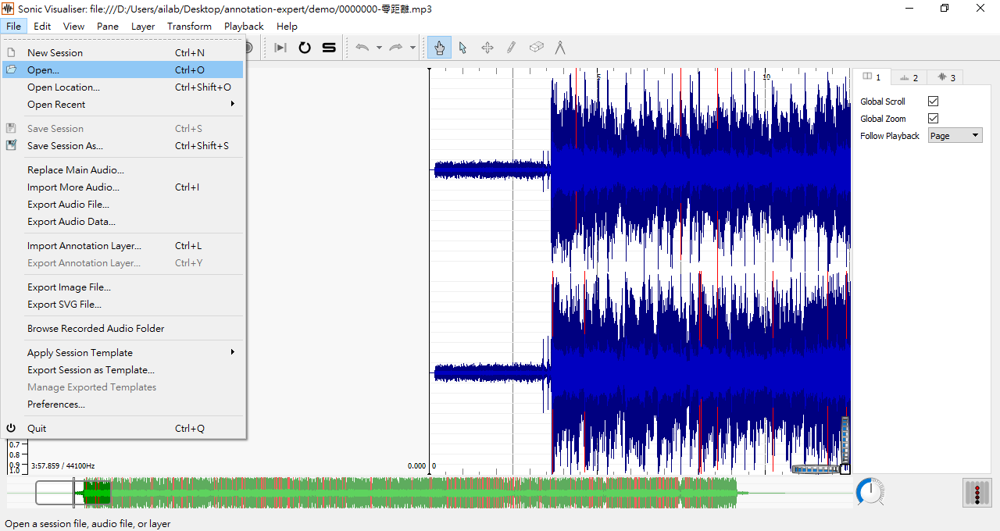
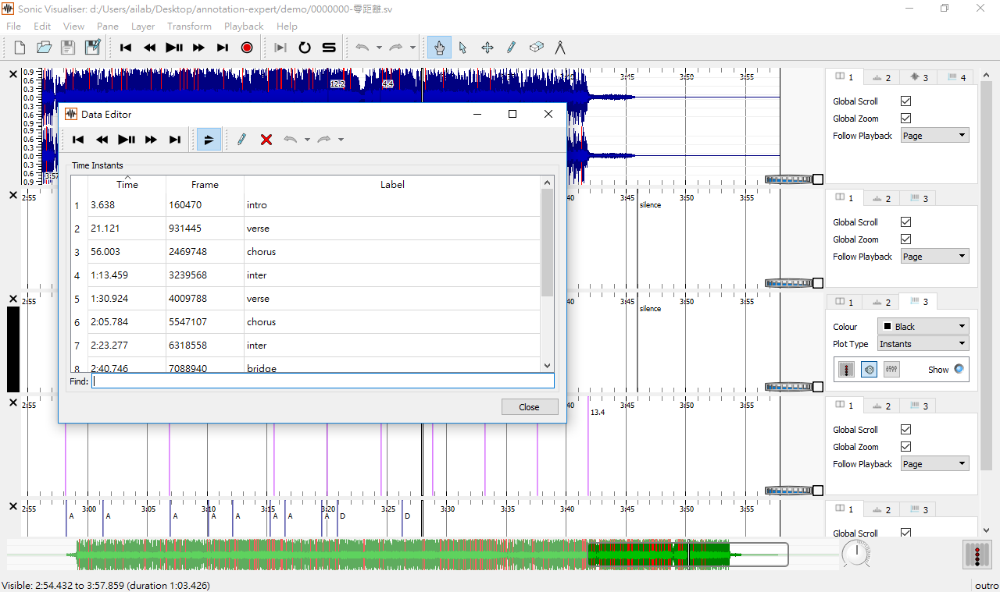
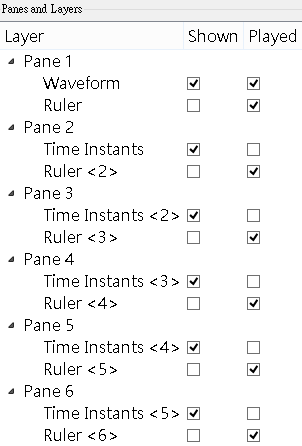
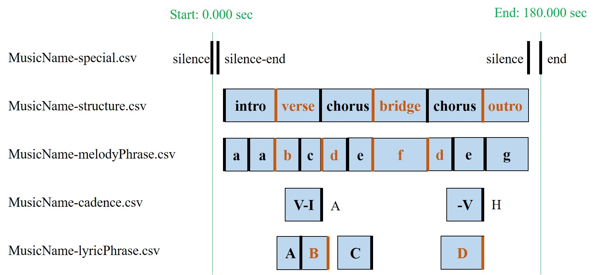
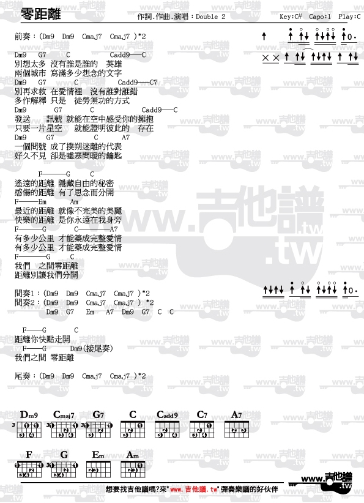

# Dataset of Music Annotation by Experts
The annotation files are the dataset containing tables of data relating to songs which are annotated by experts whose background is related to music.

## SOP of Annotation

**Getting Started**

- Sonic Visualiser [下載](https://www.sonicvisualiser.org/download.html)

**Common Shortcuts**

| 快捷鍵        | 功能                                  |
| ------------ | ------------------------------------- |
| N            | Add New Pane：新增加註工作視窗          |
| Y            | Show Layer Summery：各加註軌設定        |
| E            | Data Editor：圖層數據編輯視窗。須在目標Pane選第三層（Time Instants）Layer，才能打開進行編輯。|
| ;            | Time Instants Layer：新增一個時間標記    |
| Space        | (空白鍵)播放歌曲                        |
| Ctrl+Z       | 復原                                   |
| Ctrl+Y       | Export Annotation Layer：儲存指定格式之輸出檔案。須在目標Pane選第三層（Time Instants）Layer，才能按Ctrl+Y輸出。 |
| Ctrl+Shift+S | Save Session As：另存SV格式之工作檔           |

**Procedures**

- Step 1：選擇上方選單File > Open > 選取歌曲，或是拖曳檔案，將歌曲加載到Sonic Visualiser，此時會顯示歌曲波形。

- Step 2：選擇上方選單 Pane > Add New Pane 或快捷鍵 N 產生一個新的標記面板。此時若按分號鍵 (**;**) 會在黑色豎槓處產生一個標記 (Time Instants Layer) 。

- Step 3：按下播放(或空白鍵)並聆聽音樂，並在欲標記處按下分號鍵 (*;*) 以作標記。如果錯過的話，可按暫停播放(或再一下空白鍵)並拖移音軌至欲標記處，重新做標記。按ctrl+z (mac: command + z) 可以退回上一步。

- Step 4：整首歌標記完後，選擇上方選單 Layer > Edit Layer Data 或按快捷鍵E打開圖層數據編輯視窗 (Data Editor)，將打開一個新視窗。第一欄為時間 (已自動轉換為秒)，在第三欄輸入標記的文字敘述 (例如 intro、verse、chorus、bridge等等。)

| Time | Frame  | Label |
| ---- | ------ | ----- |
| 開始時間 | （自動帶出） | 標記名稱  |
| 結束時間 | （自動帶出） | 標記名稱  |

- Step 5：選擇上方選單 View > Show Layer Summery 或快捷鍵 Y，參考下圖設定方式，關閉加註點的聲響提示，以及各軌的尺規顯示。必須要另存新檔（Save Session As），才會把設定值寫入。自我檢查時，請關閉軟體後重新開啟該檔案。備註：在本說明的其它圖例中，尺規顯示是未關閉的狀態；demo資料夾中的範例檔則有關閉。

- Step 6：標記項目、順序與說明如下，詳細說明在Label Help

| 順序  | 項目                    | 標記                                                                                                | 說明                                                                             |
| --- | ---------------------------- | ---------------------------------------------------------------------------------------------------------- | ------------------------------------------------------------------------------ |
| 1st | **特別標記**(**Special labels)** | silence  silence-end  silence  end                                                       | 標記音檔起始空白為silence；訊號起始點為silence-end；音樂結束點為silence；整個音檔最尾端為end                  |
| 2nd | **結構(Structure)**            | intro  pre-verse  verse  pre-chorus  chorus  inter  bridge  outro  others          | 標記出音樂架構中每個"**段落的起始處**"      |
| 3rd | **樂句(Melody-based Phrase)**  | 相同曲調旋律標註相同小寫英文字母(a, b, c, etc.)                                                                        | 標記出每個”**樂句起始處”**。若26個英文字母不夠用，則比照Excel欄位使用aa、ab、ac等，依此類推。曲調旋律不限於人聲主唱，移調或漸快漸慢視為相同。任何音高或節奏差異即可嚴格認定為不同；亦可寬鬆認定，將一定程度內的差異視為相同。惟無論採用何種方式，在同一首曲子內請維持一貫相同標準。若同時有多聲部材料重疊以致無法明顯判定時，則依加註者個人主觀感受。|
| 4th | **終止式(Cadence)**             | **A:** Authentic (V-I) (V-i)  **P:** Plagal (I-IV-I) (i-iv-i)  **H:** Half (-V)  **D:** Deceptive (V-x, x=ii、IV6、iv6、vi、VI) | 左欄所有「V」可轉位，亦可為「V7、V9……等」或轉位。有用到此四個終止式即標記，標註在該終止式"**結束的時間點**"，例如V-I，就標 I 結束的時間點(因為那才是一個"分界")，label就標是哪一種終止式 |
| 5th | **歌詞句(Lyrics-based Phrase)**  | 相同歌詞句標註相同大寫英文字母(A, B, C, etc.)。                                                                                         | 標記出每句歌詞"**結束的時間點**”。若26個英文字母不夠用，則比照Excel欄位使用AA、AB、AC等，依此類推。                                                            |

- Step 7：存檔方式
  - 選擇 File > Export Annotation Layer 以儲存 Annotation 檔案，檔案格式為 .csv。
  - 每個加註軌各自輸出存成一個檔。
  - 資料夾命名法：歌號-歌名-流水號
    - 歌號：「song_id」
    - 歌名：「song_name」
    - 流水號1或2或3（3人次中的第幾人次，依照團隊公告之曲目分配表序號。）
    - 0000000-零距離-1
  - 檔案命名法：歌名-項目-流水號.csv
    - 例：當歌名為 「零距離.mp3」時，歌曲ID為1000時，最後會輸出如下的檔案
      - 0001000-零距離-special-1.csv
      - 0001000-零距離-structure-1.csv
      - 0001000-零距離-melodyPhrase-1.csv
      - 0001000-零距離-cadence-1.csv
      - 0001000-零距離-lyricPhrase-1.csv
      - 請注意歌詞句輸出檔名為「lyricPhrase」而非「lyricsPhrase」，儘管後者寫法較合理。
      - 若遇到確定無相對應內容（終止式、歌詞等）的樂曲，請複製demo資料夾裡面的「0000000-empty-example-0.csv」並依照規範修改檔名。請按本網站右上方「Clone or download」綠色按鈕下載ZIP壓縮檔再解壓縮，不要使用網頁瀏覽器直接單獨另存該檔案，否則內容可能會不同。
  - 再選擇 File > Save Session As 以儲存工作檔，檔名：歌名-流水號，檔案格式為 .sv。
      - 0001000-零距離-1.sv
  - 每期任務完成結案後，請勿私自留存MP3檔，以免觸法。
 
- Step 8（處理資料人員實作，加註者請忽略此步驟）：寫程式，產生相同結構時，標註相同大寫英文字母(A, B, C, …)
  - 檔名：歌名-structurePlus-流水號.csv
      - 0001000-零距離-structurePlus-1.csv

**Label Help**

- 結構標示方法
  - Structure、Melody-based Phrase，只標起始
    - Example 1：某首歌的 61秒至76秒為Bridge，76秒至106秒為Chorus，則標記如下：

    | Time     | Frame | Label  |
    | -------- | ----- | ------ |
    | 1:01.000 | xxx   | bridge |
    | 1:16.000 | xxx   | chorus |

  - Cadence、Lyric-based Phrase，只標結尾
    - Example 2：某首歌的61秒至76秒為歌詞句A，81秒至111秒為歌詞句B，則標記如下：

    | Time     | Frame | Label |
    | -------- | ----- | ----- |
    | 1:16.000 | xxx   | A     |
    | 1:51.000 | xxx   | B     |

- 結構標記說明
  - 前奏 (intro)：在一首歌開頭，導引出整首曲子。
  - 前導主歌(pre-verse)：在前奏與主歌之間，導引出主歌的片段。
    - 例1：新寶島康樂隊〈鼓聲若響〉主歌開始前三小節
    - 例2：Queen "Bohemian Rhapsody" 主歌開始前二小節
  - 主歌 (verse)：通常主歌會在樂曲中重複，相較於副歌，主歌的歌詞較容易在每一次重覆時變化。
  - 前導副歌 (pre-chorus)：在主歌與副歌之間，導引出副歌的片段。
    - 例1：陳奕迅〈十年〉副歌開始前八小節
    - 例2：胡夏〈那些年〉副歌開始前八小節
  - 副歌 (chorus)： 一首歌中最被強調、重複最多的片段。
  - 間奏 (inter)：通常指副歌結束到下一次主歌前面的片段。有時候主歌與主歌之間有間奏（例：孫燕姿〈遇見〉頭兩次主歌之間三小節多）。
  - 橋段 (bridge)：導引出最後一次主歌/副歌的片段，可以是人聲也可以是樂器solo。
    - 例子：戴愛玲〈對的人〉最後一次副歌開始前八小節
  - 尾奏 (outro)： 歌曲最後結束一首歌的片段。
  - 其他 (others)：自成一段但無法分的，如暫停(break)、刻意的延長(suspension)、無音樂進行之對話、環境聲等等。（例：徐千舜〈月光華華〉的intro之前、inter之前、outro之後）
  - 重複而連續的結構，請分別標出，例如chorus之後又是chorus，請標兩個，而非整合成一個。
  - 結構以角色功能來區分，並非材料內容（樂句、歌詞）來區分。譬如前奏可能用副歌的片段（例：五月天〈你不是真正的快樂〉）、間奏用前奏的片段、尾奏用副歌的片段（例：張雨生〈天天想你〉）等等，此時仍然標它在此段的作用，而非其來源段落。

- 終止式標記說明
  - 即使知道和弦，或者上網找到譜，也無法直接判斷終止式，因為必須先確定目前所在的調性，再轉換成羅馬級數，才能分類終止式。譜上可能只會標整首起始的調性，所以聆聽時要注意是否有轉調。
  - 樂句或樂曲結束處，即使有終止感，也未必符合特定的終止式語法，此時不標終止式。
  - 終止式經常與樂句或段落位置有關，所以一句 I-IV-I-V-I-V-vi之內，如果只是單純將比對規則套用下去，會出現好幾個終止式。此時要反問自己，是否真的有終止效果；若是，句子該如何修正劃分。

- 注意事項
  - 並非每一首歌都擁有上述的每一項。例如若該首曲子沒有前奏，便不需要標。
  - 結構、樂句是標起始點，不必非得等到前一個單位結束之後才標。
  - 結構、樂句起始點接近的地方，未必一定對齊同一時刻，須視音樂內容而定。
  - 終止式、歌詞句是標結束點，不必非得要標在後一個單位開始之前。
  - 終止式、歌詞句結束點接近的地方，未必一定對齊同一時刻，須視音樂內容而定。
  - 所謂起始點、結束點也可以是落在弱起拍的地方，並非一定標在正拍。
  - 手動標記位置時，時間點請盡量精準。事後檢查時，若聽音能力佳或者已經熟悉內容，可以透過主畫面右下方的 Playback Spped 調整播放速度，以節省時間。
  - 請依照下載聆聽時各自對應的曲號上傳。有些曲號不同者，雖然為同一首的同一版本，然而或許仍有秒差，必須微調工作檔，並記得改檔名與重新輸出；若加註者比對後確定完全無秒差，則將複本逐一修改檔名再上傳即可。
  - 上傳時每首須分別建立資料夾，其中包含每首的一個工作檔（sv），及五個輸出檔（csv），如同demo資料夾中的範例。此外，若原始檔名若為外文或簡體字，請注意務必遵照原本的格式，避免更動（例：字母大小寫、繁簡體）。雲端檔案上傳者即為擁有者，因此請勿上傳MP3檔，以免觸法。
  - 若先前已經輸出，但是事後要修改，卻發現開啟舊檔後無法編輯，請另開新專案。加載音檔，新增五個Pane(s)，然後依序在各Pane匯入原本五個CSV輸出檔（File -> Import Annotation Layer），即能繼續編輯、存檔、輸出。

**範例檔**

欲參考範例檔，請按本網站右上方「Clone or download」綠色按鈕下載ZIP壓縮檔再解壓縮，並將示範音樂自行下載成MP3檔，將音樂檔命名為"0000000-零距離.mp3"後移動到demo資料夾內。實際執行任務時，將會提供參與者MP3檔，無須另外下載。

- 專案網址：https://github.com/DennyHsieh/annotation-expert/
- 示範音樂：https://www.youtube.com/watch?v=94SsKt8p5jA
- 參考和弦譜：http://www.guitar-score.tw/2012/07/double-2.html, https://github.com/DennyHsieh/annotation-expert/tree/master/image/0000000-零距離-chord.jpg
- intro比樂句a稍微早開始，差異的那一小段可視為intro的intro。類似Edvard Grieg的A小調鋼琴協奏曲開頭定音鼓之作用：https://youtu.be/I1Yoyz6_Los
- 「成了撲朔迷離的代表」，剛好是最後一字時，走到了V7-I的I，整句結束後，才緊接著出現vi7，所以把這個V7-I當作Authentic終止式，vi7是兩句大段落之間的轉折，亦可直接當成chorus的開始。chorus最慢從「遙遠的」就起算，而非等到「距離」才開始。
- 「才能築成完整愛情」，還沒唱完就走到vi，所以這句其實全程是V-I-vi7才走完，沒有符合的終止式。

## References

- Sonic Visualiser [3.1.1 版本說明檔](https://www.sonicvisualiser.org/doc/reference/3.1.1/en/)，特別注意以下章節。
  - 6.5: Time Instants Layer
  - 10: Annotation by Tapping
  - 12.3: Annotation Layer Import
- [SALAMI Annotator's Guide (2010)](http://www.music.mcgill.ca/~jordan/salami/SALAMI-Annotator-Guide.pdf)
- [機器學習與智慧音樂應用 (2017)](https://speakerdeck.com/fukuball/machine-learning-and-the-intelligent-music-application)
- [電腦音樂：歷史沿革與研究近況 (2014)](http://ee.ntu.edu.tw/upload/hischool/doc/2014.03.pdf)
- 蔡振家、陳容姍（2013）。《聽情歌，我們聽的其實是……：從認知心理學出發，探索華語抒情歌曲的結構與情感》，臺北市：臉譜。

## Grants
- [MOST 105-2218-E007-031](https://www.grb.gov.tw/search/planDetail?id=12455462)
- [MOST 106-3114-E007-013](https://www.grb.gov.tw/search/planDetail?id=12484736)
- [MOST 107-2218-E007-008](https://www.grb.gov.tw/search/planDetail?id=12751283)

## Credits
- Li Su, Assistant Research Fellow, Institute of Information Science, Academia Sinica
- Hsin-Ming Lin, Postdoctoral Research Fellow, Center for Cultural Heritage Research and Innovation, Tainan National University of the Arts
- Tung-Ching Hsieh, Research Assistant, Institute of Information Systems and Applications, National Tsing Hua University
- Charles Chu, Graduate Student, Department of Music, National Tsing Hua University
- Yun-Ting Lai, Graduate Student, Department of Music, National Tsing Hua University
- Wen-Yu Hsu, Graduate Student, Department of Music, National Tsing Hua University
- Nian-Xun Xie, Graduate Student, Department of Music, National Tsing Hua University

## Note
歌詞句標記範例
  - Ex.1
> 還記得我們曾經 肩並肩一起走過 那段繁華巷口/ 
> 儘管你我是陌生人 是過路人/ 
> 但彼此還是感覺到了對方的 一個眼神 一個心跳.... 一種意想不到的快樂/ 
> 好像是 一場夢境/ 
> 命中註定/

  - Ex.2
> 別想太多 沒有誰是誰的英雄/ 
> 別再求救 在愛情裡 沒有誰對誰錯/ 
> 發送訊號 就能在空中感受你的擁抱/ 
> 一個問號 成了撲朔迷離的代表/ 
> 遙遠的距離 隱藏自由的秘密/ 
> 最近的距離 就像不完美的美麗/ 
> 有多少公里 才能築成完整愛情/ 
> 我們之間零距離/ 
> 兩個城市 寫滿多少想念的文字/ 
> 多作解釋 只是徒勞無功的方式/ 
> 只要一片星空 就能證明彼此的存在/ 
> 好久不見 卻是噓寒問暖的鑰匙/ 
> 遙遠的距離 隱藏自由的秘密/ 
> 最近的距離 就像不完美的美麗/ 
> 有多少公里 才能築成完整愛情/ 
> 我們之間零距離/ 
> 感傷的距離 有了思念而分開/ 
> 快樂的距離 是你永遠在我身旁/ 
> 有多少公里 才能築成完整愛情/ 
> 距離別讓我們分開/ 
> 距離你快點走開/ 
> 我們之間 零距離/

<!--  -->
