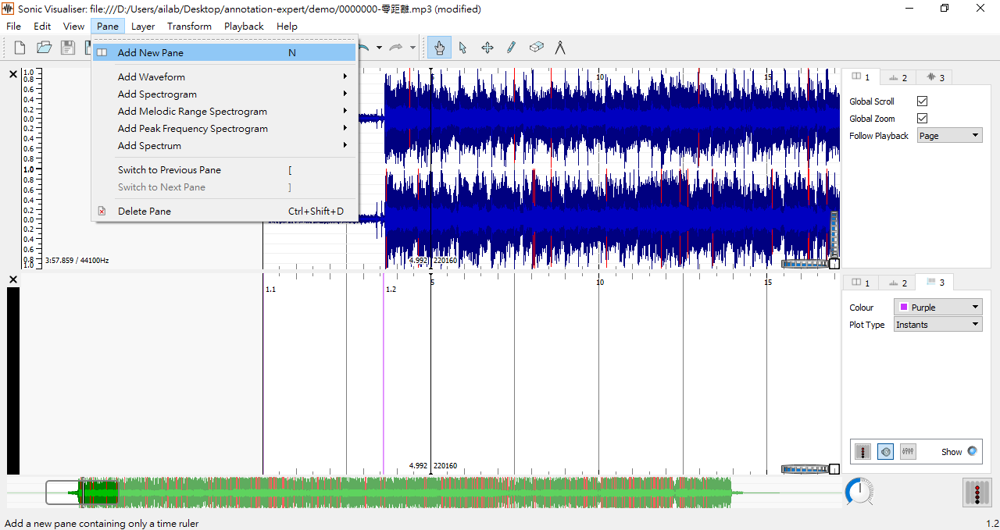

# Dataset of Music Annotation by Experts
The annotation files are the dataset containing tables of data relating to songs which are annotated by experts whose background is related to music.

## SOP of Annotation

**Getting Started**

- Sonic Visualiser [下載](https://www.sonicvisualiser.org/download.html)

**Common Shortcuts**

| 快捷鍵        | 功能                                     |
| ------------ | -------------------------------------- |
| N            | Add New Pane, 新增加註工作視窗                 |
| ;            | Time Instants Layer, 新增一個時間標記          |
| space        | (空白鍵)播放歌曲                              |
| ctrl+Z       | 復原                                     |
| ctrl+Y       | Export Annotation Layer, 儲存.csv格式之加註檔案 |
| ctrl+shift+S | Save Session As, 儲存.sv格式之工作檔           |

**Procedures**

- Step 1: 選擇上方選單File > Open > 選取歌曲，或是拖曳檔案，將歌曲加載到Sonic Visualiser，此時會顯示歌曲波形。

- Step 2:  選擇上方選單 Pane > Add New Pane 或快捷鍵 N 產生一個新的標記面板。此時若按分號鍵 (**;**) 會在黑色豎槓處產生一個標記 (Time Instants Layer) 。

- Step 3: 按下播放(或空白鍵)並聆聽音樂，並在欲標記處按下分號鍵 (*;*) 以作標記。如果錯過的話，可按暫停播放(或再一下空白鍵)並拖移音軌至欲標記處，重新做標記。按ctrl+z (mac: command + z) 可以退回上一步。
- Step 4: 整首歌標記完後，選擇上方選單 Layer > Edit Layer Data 或按快捷鍵E打開圖層數據編輯視窗 (Data Editor)，將打開一個新視窗。第一欄為時間 (已自動轉換為秒)，在第三欄輸入標記的文字敘述 (例如 intro, verse, chorus, bridge等等。)

- Step 5: 標記的格式

| Time | Frame  | Label |
| ---- | ------ | ----- |
| 開始時間 | (自動帶出) | 標記名稱  |
| 結束時間 | (自動帶出) | 標記名稱  |

- Step 6: 標記項目、順序與說明如下，詳細說明在Lable Help

| 順序  | 項目(layer)                    | 標記(Labels)                                                                                                | 說明                                                                             |
| --- | ---------------------------- | ---------------------------------------------------------------------------------------------------------- | ------------------------------------------------------------------------------ |
| 1st | **特別標記**(**Special labels)** | silence  silence-end  silence  end                                                       | 標記音檔起始空白為silence；訊號起始點為silence-end；音樂結束點為silence；整個音檔最尾端為end                  |
| 2nd | **結構(Structure)**            | intro  pre-verse  verse  pre-chorus  chorus  inter  bridge  outro  others          | 標記出音樂架構中每個"**段落的起始處**"      |
| 3rd | **樂句(Melody-based Phrase)**  | 相同樂句旋律需標註 **相同小寫字母(a, b, c, ...)**                                                                        | 標記出每個”**樂句起始處”**                                                               |
| 4th | **終止式(Cadence)**             | **A:** Authentic (V-I)  **P:** Plagal (IV-I)  **H:** Half (-V)  **D:** Deceptive (V-x, x=ii、IV6、iv6、vi、VI) | 有用到此四個終止式即標記，標註在該終止式"**結束的時間點**"，例如V-I，就標 I 結束的時間點(因為那才是一個"分界")，label就標是哪一種終止式 |
| 5th | **歌詞句(Lyric-based Phrase)**  | 一段歌詞結束的時間點                                                                                             | 標記出每句歌詞"**結束的時間點**”                                                            |

- Step 7: 存檔方式
  - 選擇 File > Export Annotation Layer 以儲存 Annotation 檔案，檔案格式為 .csv。
  - 每個大項目開一新的 Pane (Pane > Add New Pane) 做標記，各別存成一個檔。
  - 資料夾名稱：歌名-流水號
    - 歌名：“song_id-song_name”
    - 流水號1-3 (3人次中的第幾人次)
    - 0000000-零距離-1
  - 檔名取法：歌名-項目-流水號.csv
    - ex: 當歌名為 “零距離.mp3”時，歌曲ID為1000時，最後會輸出如下的檔案
      - 0001000-零距離-special-1.csv
      - 0001000-零距離-structure-1.csv
      - 0001000-零距離-melodyPhrase-1.csv
      - 0001000-零距離-cadence-1.csv
      - 0001000-零距離-lyricPhrase-1.csv
  - 再選擇 File > Save Session As 以儲存工作檔，檔名：歌名-流水號，檔案格式為 .sv。
      - 0001000-零距離-1.sv
  - 全部結束後，將原本mp3檔刪除
- Step 8(處理資料人員實作): 寫程式，產生相同結構時，標註相同大寫英文字母(A, B, C, …)
  - 檔名：歌名-structurePlus-流水號.csv
      - 0001000-零距離-structurePlus-1.csv

**Lable Help**

- 結構標示方法
  - Structure, Melody-based Phrase，只標起始
    - Example 1：某首歌的 61秒至76秒為Bridge，76秒至106秒為Chorus，則標記如下：

    | Time     | Frame | Label  |
    | -------- | ----- | ------ |
    | 1:01.000 | xxx   | bridge |
    | 1:16.000 | xxx   | chorus |

  - Cadence, Lyric-based Phrase，只標結尾
    - Example 2：某首歌的61秒至76秒為歌詞句A，81秒至111秒為歌詞句B，則標記如下：

    | Time     | Frame | Label |
    | -------- | ----- | ----- |
    | 1:16.000 | xxx   | A     |
    | 1:51.000 | xxx   | B     |

- 結構(Structure)標記說明
  - 前奏 (intro)：在一首歌開頭，導引出整首曲子。
  - 前導主歌(pre-verse)：在前奏與主歌之間，導引出主歌的片段。
    - 例1：新寶島康樂隊〈鼓聲若響〉主歌開始前三小節
    - 例2：Queen "Bohemian Rhapsody" 主歌開始前二小節
  - 主歌 (verse)：通常主歌會在樂曲中重複，相較於副歌，主歌的歌詞較容易在每一次重覆時變化。
  - 前導副歌 (pre-chorus)：在主歌與副歌之間，導引出副歌的片段。
    - 例1：陳奕迅〈十年〉副歌開始前八小節
    - 例2：胡夏〈那些年〉副歌開始前八小節
  - 副歌 (chorus)： 一首歌中最被強調、重複最多的片段。
  - 間奏 (inter)：通常指副歌結束到下一次主歌前面的片段。
  - 橋段 (bridge)：導引出最後一次主歌/副歌的片段，可以是人聲也可以是樂器solo。
    - 例子：戴愛玲〈對的人〉最後一次副歌開始前八小節
  - 尾奏 (outro)： 歌曲最後結束一首歌的片段。
  - 其他 (others)：自成一段但無法分的，如暫停(break)、刻意的延長(suspension)、無音樂進行之對話、環境聲等等。

- 可參考之結構: http://www.musicbook.com.tw/searchSong/index.asp
  - verse, chorus標在第一個音
  - 通通標在過門之後(開始唱的瞬間)

- 終止式標記說明
  - 有聽到終止式都標
  - 大原則：標大一點的段落
    - 比旋律句與歌詞句大，而比整個主歌或副歌段落小
    - 預計大多數(80~90%)的終止式為半終止(H)與正格終止(A)
  - 特殊狀況：以音樂家的意見為主，如果在以上原則之外有覺得很明顯的終止式，歡迎根據音樂家自己的見解進行標註，允許個人見解之不同

- **注意事項：**
  - 並非每一首歌都擁有上述的每一項。例如若該首曲子沒有前奏，便不需要標。
  - 有時候前奏其實是用副歌的旋律(例：五月天〈你不是真正的快樂〉)
  - 有時候主歌與主歌之間有間奏(例：孫燕姿〈遇見〉頭兩次主歌之間三小節多)(inter or interlude)

**Demo**

若想參考demo檔，請下載demo資料夾，並將示範音樂下載成mp3檔，將音樂檔命名為"0000000-零距離.mp3"後移動到demo資料夾內。

- 示範檔案：https://github.com/DennyHsieh/annotation-expert/tree/master/demo
- 示範音樂：https://www.youtube.com/watch?v=94SsKt8p5jA
- 示範和弦譜：http://www.guitar-score.tw/2012/07/double-2.html, https://github.com/DennyHsieh/annotation-expert/tree/master/image/0000000-零距離-chord.jpg

**Reference**

- Sonic Visualiser [3.0.3 版本說明檔](https://sonicvisualiser.org/doc/reference/3.0/en/index.html)
  - 特別注意[Time Instants Layer](https://sonicvisualiser.org/doc/reference/3.0/en/index.html#timeinstants)（第6.5節）和 [Annotation by Tapping](https://sonicvisualiser.org/doc/reference/3.0/en/index.html#tapping) 的說明（第10節）
- [SALAMI annotation guide](http://www.music.mcgill.ca/~jordan/salami/SALAMI-Annotator-Guide.pdf)

## Especially Thanks
- Li Su, Academia Sinica, Institute of Information Science, Taiwan
- Charles Chu, Dep. of Music, National Tsing Hua University, Hsinchu, Taiwan 
- Yun-Ting Lai, Dep. of Music, National Tsing Hua University, Hsinchu, Taiwan 
- Nian-Xun Xie, Dep. of Music, National Tsing Hua University, Hsinchu, Taiwan 

## Note
歌詞句標記範例
  - Ex.1
> 還記得我們曾經 肩並肩一起走過 那段繁華巷口/ 
> 儘管你我是陌生人 是過路人/ 
> 但彼此還是感覺到了對方的 一個眼神 一個心跳.... 一種意想不到的快樂/ 
> 好像是 一場夢境/ 
> 命中註定/

  - Ex.2
> 別想太多 沒有誰是誰的英雄/ 
> 別再求救 在愛情裡 沒有誰對誰錯/ 
> 發送訊號 就能在空中感受你的擁抱/ 
> 一個問號 成了撲朔迷離的代表/ 
> 遙遠的距離 隱藏自由的秘密/ 
> 最近的距離 就像不完美的美麗/ 
> 有多少公里 才能築成完整愛情/ 
> 我們之間零距離/ 
> 兩個城市 寫滿多少想念的文字/ 
> 多作解釋 只是徒勞無功的方式/ 
> 只要一片星空 就能證明彼此的存在/ 
> 好久不見 卻是噓寒問暖的鑰匙/ 
> 遙遠的距離 隱藏自由的秘密/ 
> 最近的距離 就像不完美的美麗/ 
> 有多少公里 才能築成完整愛情/ 
> 我們之間零距離/ 
> 感傷的距離 有了思念而分開/ 
> 快樂的距離 是你永遠在我身旁/ 
> 有多少公里 才能築成完整愛情 
> 距離別讓我們分開 
> 距離你快點走開/ 
> 我們之間 零距離/

<!--  -->